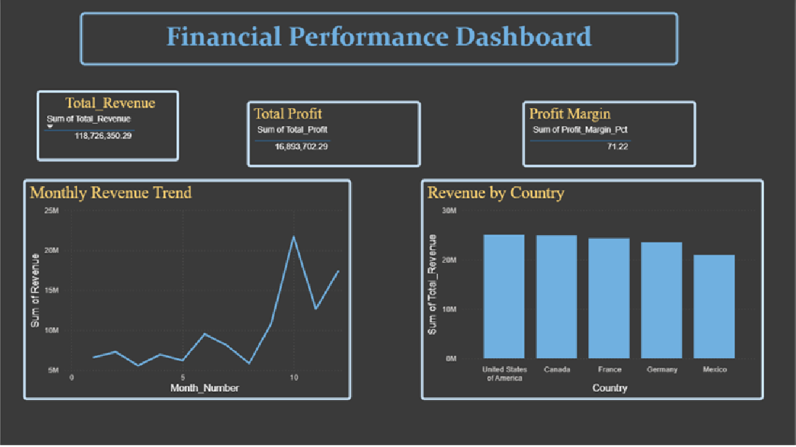
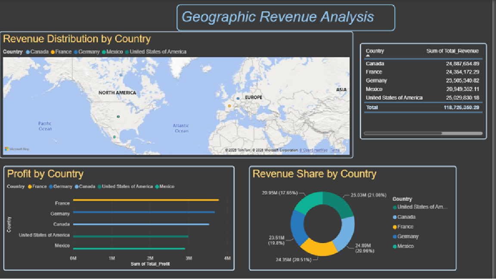
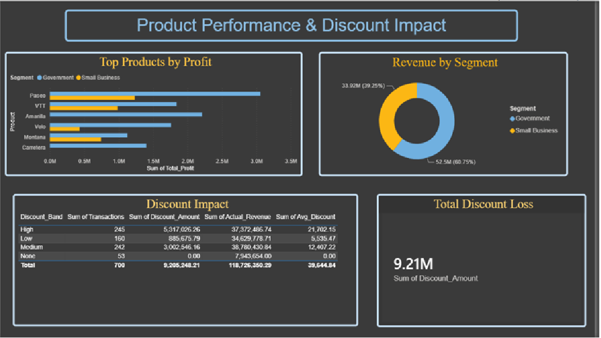

# Financial Performance Analytics Dashboard

An interactive 3-page Power BI dashboard analyzing financial performance, 
built using SQL for data extraction and DAX for business calculations.

## Tools Used
- MySQL Workbench — database design and SQL querying
- Power BI Desktop — data visualization and modeling
- DAX — calculated measures (profit margin %, revenue trends)

## Dashboard Pages

### 1. Executive Summary
KPI cards for total revenue, profit, and profit margin, plus monthly revenue trend and revenue by country.

### 2. Geographic Analysis
Interactive map showing revenue distribution by country, profit comparison, and revenue share breakdown.

### 3. Product Analysis
Top products by profit, revenue by segment, and discount impact analysis across regions.

## Key Insights
- United States generated the highest revenue at $25M
- Average profit margin across all regions was 71%
- Discounts reduced overall revenue by approximately $9.2M
- Paseo and VTT were the most profitable products

## Files
- `Financial Performance Dashboard.pbix` — Power BI dashboard file
- `queries.sql` — SQL queries used for data extraction and transformation
